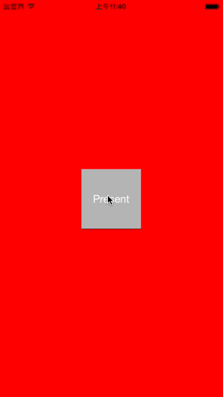

# TransitionKit

###Screenshot 

#### SemiModel Transition




#### Gate Transition


## Installation

### Carthage

```swift
github "cp3hnu/TransitionKit"
```

*   Drag and drop *TransitionKit.framework* from /Carthage/Build/iOS/ to Linked frameworks and libraries in Xcode (Project>Target>General>Linked frameworks and libraries)

*   Add new run script

       ```
      /usr/local/bin/carthage copy-frameworks
       ```

*   Add Input files *$(SRCROOT)/Carthage/Build/iOS/TransitionKit.framework*


##Getting Started
### SemiModel Transition

```swift
private let semiModelTransition = SemiModelTransition(distance: 200)

func present() {
	let controller = SecondViewController()
	controller.transitioningDelegate = semiModelTransition
	presentViewController(controller, animated: true, completion: nil)
}

//SecondViewController.swift
init() {
    modalPresentationStyle = .Custom
}
```

### Gate Transition

```swift
private let gateTransition = GateTransition(sawtoothCount: 20, sawtoothDistance: 20)

override func viewDidLoad() {
	super.viewDidLoad()
    navigationController?.delegate = gateTransition
}
```


##Requirements
iOS 8.0+
