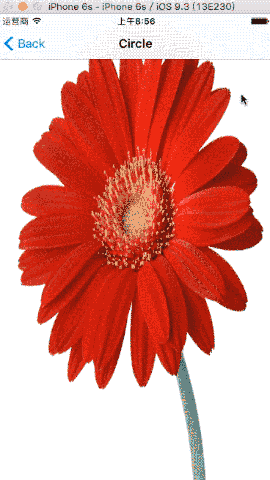
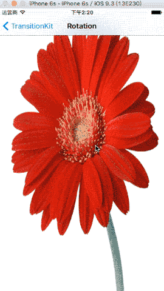
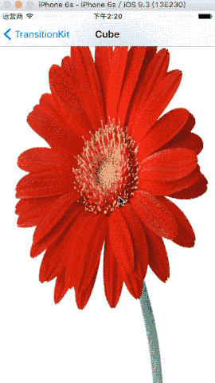
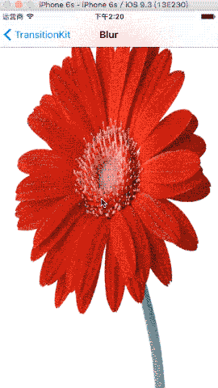

# TransitionKit

## Transitions

* Semi Model Transition

* Gate Transition

* Circle Transition

* Rotation Transition

* Book Transition

* Flip Transition

* Cube Transition

* Blur Transition

  ​

## Screenshot

#### SemiModel Transition


#### Gate Transition


#### Circle Transition




#### Rotation Transition




#### Book Transition


#### Flip Transition


#### Cube Transition




#### Blur Transition



## Installation

#### Carthage

```swift
github "cp3hnu/TransitionKit"
```

1. Drag and drop *TransitionKit.framework* from /Carthage/Build/iOS/ to Linked frameworks and libraries in Xcode (Project>Target>General>Linked frameworks and libraries)

2. Add new run script

   ```swift
     /usr/local/bin/carthage copy-frameworks
   ```

3. Add Input files *$(SRCROOT)/Carthage/Build/iOS/TransitionKit.framework*


##Requirements
iOS 8.0+

Xcode 7.3+


## License

Released under the MIT license. See LICENSE for details.

